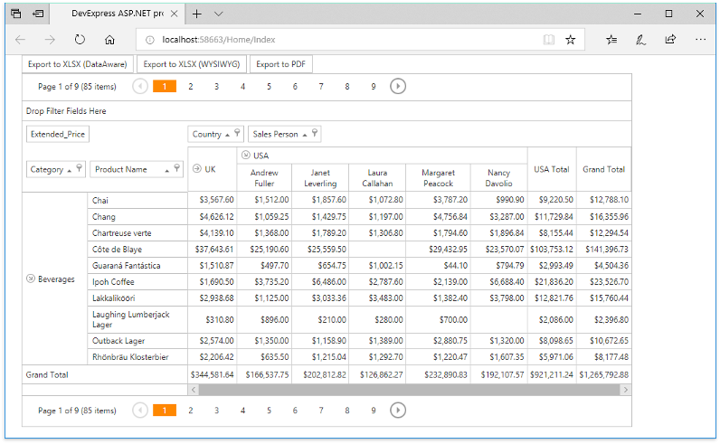

<!-- default badges list -->

<!-- default badges end -->
# How to Export ASP.NET MVC Pivot Grid to PDF and XLSX Formats with Custom Settings

This example demonstrates how to export [ASP.NET MVC Pivot Grid](https://docs.devexpress.com/AspNet/10689/asp.net-mvc-extensions/pivot-grid) to PDF and XLSX formats, specify various export options and customize the exported cell's content and appearance.

The following image shows the [MVCXPivotGrid](https://docs.devexpress.com/AspNet/DevExpress.Web.Mvc.MVCxPivotGrid) when the example is run.

Click the _Export to XLSX (DataAware)_, _Export to XLSX (WYSIWYG)_ or _Export to PDF_ button to perform export.

Export to XLSX format is performed using the [PivotGridExtension.ExportToXlsx](https://docs.devexpress.com/AspNet/DevExpress.Web.Mvc.PivotGridExtension.ExportToXlsx(DevExpress.Web.Mvc.PivotGridSettings-System.Object-DevExpress.XtraPrinting.XlsxExportOptions)) method. To specify export options, this example creates the [PivotXlsxExportOptions](https://docs.devexpress.com/AspNet/DevExpress.Web.ASPxPivotGrid.PivotXlsxExportOptions) class instance, modifies it as required and passes to the method as a parameter. The **PivotXlsxExportOptions** type is properly accepted because it inherits the [XlsxExportOptions](https://docs.devexpress.com/CoreLibraries/DevExpress.XtraPrinting.XlsxExportOptions) class.

To customize the cell content and appearance individually for each cell, this example handles the [PivotXlsxExportOptions.CustomizeCell](https://docs.devexpress.com/AspNet/DevExpress.Web.ASPxPivotGrid.PivotXlsxExportOptions.CustomizeCell) event.

Default [export type](https://docs.devexpress.com/CoreLibraries/DevExpress.Export.ExportType) is data-aware. The resultant file is shown below.

To set the export type to WYSIWYG, this example uses the [PivotGridExtension.ExportToXlsx](https://docs.devexpress.com/AspNet/DevExpress.Web.Mvc.PivotGridExtension.ExportToXlsx(DevExpress.Web.Mvc.PivotGridSettings-System.Object-DevExpress.XtraPrinting.XlsxExportOptions)) method with the [DevExpress.XtraPrinting.XlsxExportOptionsEx](https://docs.devexpress.com/CoreLibraries/DevExpress.XtraPrinting.XlsxExportOptionsEx) parameter whose **ExportType property** is set to the **DevExpress.Export.ExportType.WYSIWYG** value. The resultant file is shown below.

Export to PDF is performed using the [PivotGridExtension.ExportToPdf](https://docs.devexpress.com/AspNet/DevExpress.Web.Mvc.PivotGridExtension.ExportToPdf(DevExpress.Web.Mvc.PivotGridSettings-System.Object)) method with the [PivotGridSettings](https://docs.devexpress.com/AspNet/DevExpress.Web.Mvc.PivotGridSettings) instance passed as the method parameter. The [PivotGridSettings.SettingsExport.OptionsPrint](https://docs.devexpress.com/AspNet/DevExpress.Web.Mvc.MVCxPivotGridExportSettings.OptionsPrint) property is used to specify page settings. 

To customize the cell content and appearance individually for each cell, this example handles the [PivotGridSettings.SettingsExport.CustomExportCell](https://docs.devexpress.com/AspNet/DevExpress.Web.Mvc.MVCxPivotGridExportSettings.CustomExportCell) event.

